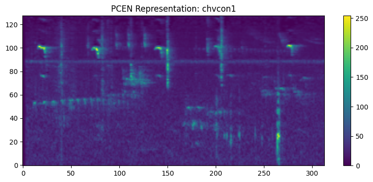

# BirdCLEF 2026: Pantanal Wetlands Acoustic Biodiversity Monitoring

## Overview
This repository contains a machine learning framework developed for the continuous identification of understudied wildlife species within the Pantanal wetlands of Brazil. The Pantanal spans over 150,000 square kilometers and hosts a complex ecological community comprising birds, amphibians, mammals, reptiles, and insects. 

Understanding how these communities respond to environmental change is a central challenge in conservation science. This project leverages passive acoustic monitoring (PAM) to process continuous, multi-species soundscapes, circumventing the logistical limitations of conventional fieldwork. 

The primary objective is to accurately classify 234 target species (ranging from identified taxa to specific insect sonotypes) from messy, field-collected audio data to support evidence-based conservation initiatives. To achieve this, the model leverages focal recordings sourced from Xeno-canto and iNaturalist, alongside expert-labeled continuous recordings. The resulting inference engine evaluates 1-minute continuous test soundscapes sampled at 32 kHz by predicting species presence probabilities across discrete 5-second temporal windows.

## Competition Parameters & Constraints
This solution was engineered to strictly adhere to the Kaggle BirdCLEF 2026 submission requirements:
- **Evaluation Metric:** Macro-averaged ROC-AUC (skipping classes with no true positives).
- **Inference Constraints:** 90-minute runtime limit, CPU-only execution, and completely disabled internet access.
- **Temporal Resolution:** Predictions are made on non-overlapping 5-second acoustic windows extracted from continuous 1-minute field recordings.

## Repository Structure
- `Main.ipynb`: The dual-phase model training pipeline.
- `Inference.ipynb`: The offline, CPU-bound inference engine for processing unlabelled continuous soundscapes.
- `Requirements.txt`: Environment dependencies.
- `output.png`: Sample visualization of the acoustic feature extraction pipeline.

## Technical Approach: Dual-Phase Optimization
The sheer volume of ambient noise in the Pantanal ecosystem presents a significant distribution shift from isolated, clean bird recordings. To counter this, the training pipeline employs a dual-phase domain adaptation strategy.

### Phase 1: Pure Audio Mastery (Isolated Feature Extraction)
The network is initially optimized on pristine, single-label audio samples. To prevent the model from overfitting to ambient silence at the start of recordings, a stochastic temporal cropping mechanism selects random 5-second windows.
- **Learning Rate:** $1 \times 10^{-4}$ (OneCycleLR Scheduler)
- **Objective:** Establish robust intermediate representations of avian morphologies without background interference.

### Phase 2: Forest IRL Generalization (Noisy Domain Adaptation)
The pre-trained weights from Phase 1 are fine-tuned on real-world, noisy multi-label soundscapes. The optimization parameters are heavily constrained to prevent catastrophic forgetting of the pure acoustic features.
- **Learning Rate:** $2 \times 10^{-5}$ (OneCycleLR Scheduler)
- **Objective:** Force the network to identify known acoustic patterns amidst significant background degradation and overlapping species vocalizations.

## Acoustic Feature Extraction
Standard logarithmic Mel-spectrograms are highly susceptible to variance in ambient background noise. To isolate transient wildlife vocalizations, this pipeline applies Per-Channel Energy Normalization (PCEN). 

PCEN normalizes the spectrogram $E(t, f)$ using a temporally smoothed version $M(t, f)$. The operation acts as a dynamic range compressor and is defined mathematically as:

$$PCEN(t, f) = \left( \frac{E(t, f)}{(M(t, f) + \epsilon)^\alpha} + \delta \right)^r - \delta^r$$

This formulation aggressively whitens stationary background noise (such as wind or water) while enhancing the high-energy acoustic signatures typical of avian calls.

### Feature Visualization
Below is a comparative visualization demonstrating the noise-suppression capabilities of our PCEN pipeline against standard processing.



## Model Architecture
The spatial feature extractor is built upon the **ConvNeXt-Tiny** architecture, initialized with ImageNet weights during training and instantiated from local weights during inference.
- **Input:** 3-channel (RGB-stacked) pseudo-image matrices derived from the PCEN spectrograms.
- **Classification Head:** The fully connected layer is projected to a 234-dimensional space, corresponding to the target species.. 
- **Regularization:** A dropout rate of 0.2 (0.3 during inference testing) is applied to mitigate over-parameterization.
- **Loss Function:** Binary Cross-Entropy with Logits Loss (`BCEWithLogitsLoss`), operating under a multi-label classification paradigm.

## Installation and Execution

1. Clone the repository and install the dependencies:
   ```bash
   pip install -r Requirements.txt
